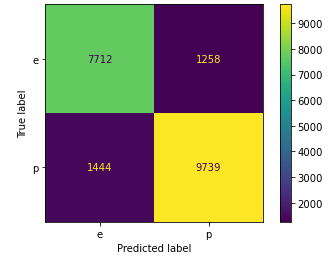

# MushroomClassifier
Harrison Carter
Flatiron School NYC Data Science

## Business Understanding
Determining the edibility of mushrooms is of crucial importance in the field. Our field guide uses a data science approach to determine the edibility of any given mushroom within the 173 species provided in the supplementary dataset. This classifier has potential uses as a classifier of unknown species, and can be used by a lay person to determine the edibility of the mushroom in question.

## Data Understanding
The data used for training and testing is a synthetic dataset generated expressly for the purpose of machine learning classification. The data was generated from the secondary dataset of 173 real mushroom species, meaning all entries in the testing set are properly labeled and correspond to a known species. The generative data for each of these species contains 353 hypothetical with minor variations on the numerical portion of the data. For this reason, we expect the classification scores to be very high, provided we find the best model. This will impose some limitations down the line that we will discuss later.

## Modelling
For the rest of the project, we rely heavily on sklearn's Pipeline to create and assess our models. We first combine the transformers under the ColumnTransformer. We then establish our baseline model pipeline using the logistic regression classifier and fit it to the training data, and determine the accuracy of the model on training and test data sets. Below is the baseline confusion matrix, ROC curve, and classification report.

The model is surprisingly good for a baseline, but we need to ensure we increase recall. This is because false negatives in this case represent mushrooms that are classified as edible but are in fact poisonous. We will need a model with a better score, and then we also need to increase the threshold to reduce our false negatives. We then try a decision tree model by replacing the logistic regression model in the pipeline. The model trains at 1.0 and tests at 0.9986, which is fantastic, but take a look at the confusion matrix below.

This model is almost exactly what we want. We only need to eliminate this false negative by tuning the decision threshold, which I will need to consult a data scientist to determine an appropriate value for. We know it will be greater than 0.5 and less than 1 but this is a very delicate part of the model that requires an informed decision. Typically, this is calculated by finding the harmonic mean between precision and recall scores, but here we want to favor recall. Arbitrarily increasing this value could invalidate the model.

Note: depending on how the random state that I couldn't pinpoint turns out, this false negative may dissapear in place of a false positive. Because this results from a random state change, the point above still stands.

Lets try to perfect the model. Using KNN here may seem counterintuitive. When the dimensionality of the dataset goes up (more predictor columns), KNN takes exponentially longer to calculate due to each extra dimension adding another dimension of distance to calculate. The following grid search is by far the longest calculation we make, taking approximately 31 minutes, sometimes up to an hour. Interestingly, we can create here a model with perfect accuracy and recall. For this and any generative data from the original 173 mushrooms, this model should perform at maximum recall. For full grown regular mushrooms of these species found in the wild this model should also perform extremely well. The following are the best hyperparameters for this model:

To ensure the model does indeed work, lets create some fake test data containing twenty known mushrooms, one of which is misclassified. After running the model on this new data, the test score is then 0.95 or 95% accuracy (19/20 = 0.95) as expected.

## Evaluation

The limitations of this model are that because the data is generative from healthy adult mushrooms, it may not work on samples that are in a different stage of growth, stunted, diseased, etc. While these samples would generally be considered noise, the model is essentially only trained on signal, so it may not classify them well. We do not know until we try. Deploying this model should be done in two ways. To make a classification app, use the KNN model as even though it is more computationally taxing, determining one data point at a time should be virtually instant, and we can set the threshold to eliminate false negatives. It may also be worth investing time into identifying what mushroom you actually have through the app which can easily be done with the corresponding primary dataset. Second, to make a field guide, use the decision tree generated by the random forest to demarcate each splitting path you take through the book to identify the mushroom. easy to organize. Either model's predictive power on newly discovered mushrooms should also be assessed as touched on before.